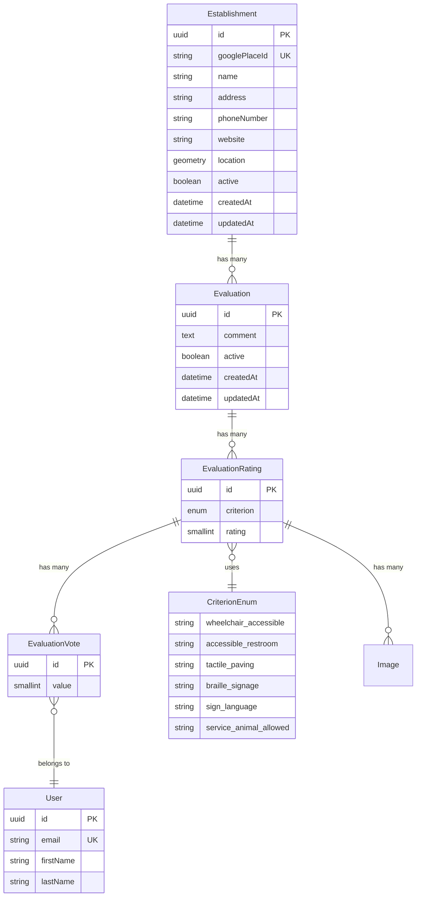
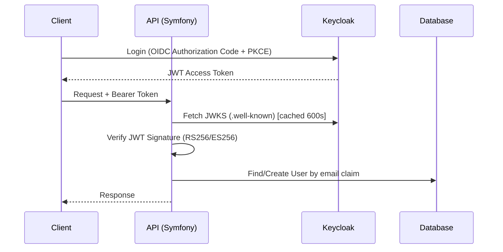

# ARCHITECTURE.md — API de Avaliação de Acessibilidade

> **Propósito**: Arquivo de contexto para assistentes de IA. Contém a arquitetura completa da API,
> modelo de domínio, padrões, convenções e integrações. Leia este arquivo antes de gerar código.

---

## Stack Técnica

| Camada         | Tecnologia                                    | Versão     |
|----------------|-----------------------------------------------|------------|
| Linguagem      | PHP                                           | ≥ 8.5     |
| Framework      | Symfony                                       | 8.1.*      |
| API            | API Platform                                  | 4.3.17     |
| ORM            | Doctrine ORM                                  | 3.6+       |
| Banco          | PostgreSQL + PostGIS                          | 16 + 3.4   |
| Auth           | Keycloak (OIDC) + JWT (`web-token/jwt-bundle`)| 26 / 4.1   |
| Real-time      | Mercure (embutido no Caddy/FrankenPHP)        | —          |
| AI             | OpenAI API (`openai-php/symfony`)             | 0.19       |
| Upload         | VichUploader + KnpGaufrette + LiipImagine     | 2.9+       |
| Cache HTTP     | Souin (invalidação via API Platform)           | —          |
| Server         | FrankenPHP (Caddy)                            | —          |
| Testes         | PHPUnit 13 + PHPStan 2 + Rector 2            | —          |
| Fixtures       | Zenstruck Foundry                             | 2.11       |
| Frontend       | Next.js 16 + React 19 + React Admin 5         | —          |

---

## Domínio

Sistema de **avaliação de acessibilidade de estabelecimentos**. Usuários avaliam locais físicos
com notas (0–10) em critérios de acessibilidade e podem votar nas avaliações de outros usuários.

### Fluxo Principal

```
Usuário autenticado (OIDC)
    │
    ├─ POST /evaluations
    │   ├─ Envia: establishmentGooglePlaceId + ratings[] + comment
    │   ├─ Processor busca ou cria Establishment via Google Places API
    │   ├─ Validator OpenAI Moderation verifica comment
    │   └─ Persiste Evaluation + EvaluationRating[]
    │
    ├─ POST /evaluation_votes
    │   ├─ Envia: evaluation IRI + value (+1 ou -1)
    │   └─ Processor faz upsert (1 voto por usuário por avaliação)
    │
    └─ GET /establishments
        ├─ Filtros: name, address, criterion_average
        └─ Retorna: dados + evaluationsSummary (média por critério)
```

---

## Modelo de Dados (Entidades)

### Diagrama ER



### Detalhes por Entidade

#### `Establishment` — `api/src/Entity/Establishment.php`
- **Schema.org**: `https://schema.org/LocalBusiness`
- **Traits**: `RegisterDateTimeTrait`, `RegisterActiveTrait`
- **Propriedades**:
  - `id` (UUID, auto)
  - `googlePlaceId` (string, unique, nullable)
  - `name` (string, filtro SearchFilter partial + OrderFilter)
  - `address` (string, nullable, filtro SearchFilter partial)
  - `phoneNumber`, `website` (string, nullable)
  - `location` (PostGIS geometry — `POINT(longitude latitude)`)
  - `evaluations` (OneToMany → Evaluation, cascade remove)
- **Método computado**: `getEvaluationsSummary()` — média e contagem por critério, exclui avaliações com netVotes ≤ -3
- **Endpoints**:
  - `GET /establishments` (público, com filtro `criterion_average`)
  - `GET /establishments/{id}` (público)
  - `PATCH /admin/establishments/{id}` (OIDC_ADMIN)
  - `DELETE /admin/establishments/{id}` (OIDC_ADMIN, processor: `EstablishmentRemoveProcessor`)

#### `Evaluation` — `api/src/Entity/Evaluation.php`
- **Schema.org**: `https://schema.org/Review`
- **Traits**: `RegisterDateTimeTrait`, `RegisterActiveTrait`
- **Propriedades**:
  - `id` (UUID, auto)
  - `comment` (text, nullable, validado com `#[AppAssert\OpenAiModeration]`)
  - `ratings` (OneToMany → EvaluationRating, cascade persist+remove)
  - `establishment` (ManyToOne → Establishment, not null)
  - `establishmentGooglePlaceId` (string, write-only — usado no POST)
- **Endpoints**:
  - `GET /evaluations` (público, provider: `EvaluationCurrentUserVoteProvider`)
  - `GET /evaluations/{id}` (público, provider: `EvaluationCurrentUserVoteProvider`)
  - `POST /evaluations` (OIDC_USER, processor: `EvaluationPersistProcessor`)
  - `PATCH /admin/evaluations/{id}` (OIDC_ADMIN)
  - `DELETE /admin/evaluations/{id}` (OIDC_ADMIN)

#### `EvaluationRating` — `api/src/Entity/EvaluationRating.php`
- **Sem operações diretas** (`operations: []`)
- **Embedded** em `Evaluation` via serialization groups
- **Propriedades**:
  - `id` (UUID)
  - `evaluation` (ManyToOne → Evaluation)
  - `criterion` (CriterionEnum, not null)
  - `rating` (smallint, 0–10, `#[Assert\Range(min: 0, max: 10)]`)
  - `votes` (OneToMany → EvaluationVote, cascade persist+remove)
  - `images` (ManyToMany unidirecional → Image)
  - `currentUserVote` (?int, **não persistido** — populado pelo `EvaluationCurrentUserVoteProvider`)
- **Método computado**: `getNetVotes()` — soma algébrica dos votos (+1/-1) neste rating

#### `EvaluationVote` — `api/src/Entity/EvaluationVote.php`
- **Constraint**: UniqueEntity `['evaluationRating', 'user']`
- **Propriedades**:
  - `id` (UUID)
  - `evaluationRating` (ManyToOne → EvaluationRating, SearchFilter exact)
  - `user` (ManyToOne → User, SearchFilter exact, auto-preenchido)
  - `value` (smallint, `Assert\Choice([1, -1])`)
- **Endpoints**:
  - `POST /evaluation_votes` (OIDC_USER, processor: `EvaluationVotePersistProcessor`)
  - `GET /evaluation_votes` (OIDC_USER)

#### `User` — `api/src/Entity/User.php`
- **Schema.org**: `https://schema.org/Person`
- **Implements**: `UserInterface`
- **Tabela**: `"user"` (quoted)
- **Propriedades**: `id` (UUID), `email` (unique), `firstName`, `lastName`
- **Método**: `getName()` → `"{firstName} {lastName}"`
- **Sync**: Criado/atualizado automaticamente pelo `UserProvider` no primeiro login OIDC
- **Endpoints**:
  - `GET /admin/users` (OIDC_ADMIN, filtro NameFilter)
  - `GET /admin/users/{id}` (OIDC_ADMIN)
  - `GET /users/{id}` (somente o próprio usuário: `object === user`)

#### `CriterionEnum` — `api/src/Enum/CriterionEnum.php`
- **Tipo**: PHP backed enum (string)
- **Exposto como API Resource** via `EnumApiResourceTrait`
- **Casos**:
  - `wheelchair_accessible` — Acesso físico (rampas, elevadores, portas largas)
  - `accessible_restroom` — Banheiros adaptados
  - `tactile_paving` — Piso tátil
  - `braille_signage` — Sinalização em Braille
  - `sign_language` — Atendimento em Libras
  - `service_animal_allowed` — Animais de serviço
- **Endpoints**: `GET /criterion_enums`, `GET /criterion_enums/{id}`

#### `Image` e `File` — `api/src/Entity/Image.php`, `api/src/Entity/File.php`
- **Schema.org**: `https://schema.org/MediaObject`
- **Upload**: VichUploader + KnpGaufrette (local em dev, S3 em prod)
- **Image** tem thumbnails via LiipImagine: `contentUrlXs` (150px), `contentUrlSm` (300px), `contentUrlMd` (600px), `contentUrlLg` (1200px)
- **Endpoints**: `GET`, `POST` (multipart/form-data)

---

## Serialization Groups

| Grupo                         | Usado em                                  | Direção |
|-------------------------------|-------------------------------------------|---------|
| `Establishment:read`          | GET público de Establishment              | Output  |
| `Establishment:read:admin`    | GET admin de Establishment                | Output  |
| `Establishment:write`         | POST/PATCH de Establishment               | Input   |
| `Evaluation:read`             | GET público de Evaluation + embed em Establishment | Output |
| `Evaluation:read:admin`       | GET admin de Evaluation                   | Output  |
| `Evaluation:write`            | POST de Evaluation                        | Input   |
| `EvaluationVote:read`         | GET de EvaluationVote                     | Output  |
| `EvaluationVote:write`        | POST de EvaluationVote                    | Input   |
| `User:read`                   | GET de User                               | Output  |
| `DateTime:read`               | createdAt/updatedAt (trait)               | Output  |
| `Active:read`                 | active (trait)                            | Output  |
| `image:read` / `file:read`    | GET de Image/File                         | Output  |

---

## Camada de Processamento (State Processors)

### `EvaluationPersistProcessor`
**Arquivo**: `api/src/State/Processor/EvaluationPersistProcessor.php`
**Trigger**: `POST /evaluations`

1. Valida que `establishmentGooglePlaceId` foi enviado
2. Busca `Establishment` por `googlePlaceId` no banco
3. Se não existe: chama `GooglePlacesClient::getPlaceDetails()` → cria `Establishment` com dados do Google
4. Associa `establishment` ao `Evaluation`
5. Delega para `PersistProcessor` do Doctrine

### `EvaluationVotePersistProcessor`
**Arquivo**: `api/src/State/Processor/EvaluationVotePersistProcessor.php`
**Trigger**: `POST /evaluation_votes`

1. Verifica autenticação (`$security->getUser()`)
2. Busca voto existente do mesmo usuário para o mesmo **rating**
3. Se existe: atualiza `value` (upsert)
4. Se não existe: associa `user` e persiste novo voto

### `EstablishmentRemoveProcessor`
**Arquivo**: `api/src/State/Processor/EstablishmentRemoveProcessor.php`
**Trigger**: `DELETE /admin/establishments/{id}`

1. Desativa todas as avaliações em batch (`setAllEvaluationsStatus(id, false)`)
2. Delega para `RemoveProcessor` do Doctrine

---

## State Provider

### `EvaluationCurrentUserVoteProvider`
**Arquivo**: `api/src/State/Provider/EvaluationCurrentUserVoteProvider.php`
**Operações**: `GET /evaluations`, `GET /evaluations/{id}`

1. Delega para o provider padrão do Doctrine (CollectionProvider ou ItemProvider)
2. Se o usuário está autenticado:
   - Coleta todos os `EvaluationRating` IDs dos resultados
   - Executa **uma única query**: busca todos os votos do usuário nesses ratings
   - Popula `$rating->currentUserVote` em cada rating (1, -1, ou null)
3. Se não autenticado: `currentUserVote` fica `null` (default)

---

## Segurança e Autenticação

### Fluxo de Autenticação



### Componentes de Segurança

| Componente | Arquivo | Função |
|---|---|---|
| `UserProvider` | `Security/Core/UserProvider.php` | Cria/atualiza User local a partir de claims OIDC (`email`, `given_name`, `family_name`) |
| `OidcDiscoveryTokenHandler` | `Security/Http/AccessToken/Oidc/OidcDiscoveryTokenHandler.php` | Discovery de JWKS via `.well-known`, verificação de JWT |
| `OidcRoleVoter` | `Security/Voter/OidcRoleVoter.php` | Checa roles `OIDC_*` contra `realm_access.roles` do JWT |
| `OidcTokenIntrospectRoleVoter` | `Security/Voter/OidcTokenIntrospectRoleVoter.php` | Checa roles via endpoint de introspecção do Keycloak |
| `OidcTokenPermissionVoter` | `Security/Voter/OidcTokenPermissionVoter.php` | Permissões UMA do Keycloak |

### Roles

| Role | Significado | Usado em |
|---|---|---|
| `OIDC_USER` | Usuário autenticado via OIDC | POST /evaluations, POST /evaluation_votes |
| `OIDC_ADMIN` | Administrador (realm role) | /admin/* endpoints |
| `ROLE_ADMIN` / `ROLE_SUPER_ADMIN` | Bypass do VisibilityExtension | Queries internas |

---

## Integrações Externas

### Google Places API (New)
**Arquivo**: `api/src/Service/GooglePlacesClient.php`

- **Endpoint**: `https://places.googleapis.com/v1/places/{placeId}`
- **Headers**: `X-Goog-Api-Key`, `X-Goog-FieldMask`, `Accept-Language: pt-BR`
- **Campos retornados**: `displayName`, `location` (lat/lng), `formattedAddress`, `nationalPhoneNumber`, `websiteUri`
- **Uso**: Chamado pelo `EvaluationPersistProcessor` quando um establishment não existe no banco

### OpenAI Moderation API
**Arquivo**: `api/src/Validator/OpenAiModerationValidator.php`

- **Pacote**: `openai-php/symfony`
- **Uso**: Constraint de validação `#[AppAssert\OpenAiModeration]` aplicada ao campo `comment` de `Evaluation`
- **Fluxo**:
  1. Ignora valores nulos/vazios
  2. Chama `$openAi->moderations()->create(['input' => $value])`
  3. Se `$response->results[0]->flagged === true` → violation
- **Mensagem**: "O comentário viola nossas diretrizes de comunidade por conter linguagem inapropriada, assédio ou discurso de ódio."
- **Falha silenciosa**: Em caso de erro de rede, o comentário passa (fail-open)

### Mercure (Real-time SSE)
- Configurado em cada `ApiResource` com tópicos dinâmicos via expressões
- Hub embutido no FrankenPHP/Caddy
- Publica atualizações automáticas em criação, edição e exclusão de recursos

---

## Filtros e Extensões Doctrine

### `VisibilityExtension`
**Arquivo**: `api/src/Doctrine/Orm/Extension/VisibilityExtension.php`

- Aplica `WHERE active = true` em toda query de entidades que usam `RegisterActiveTrait`
- **Bypass**: Admins (`ROLE_ADMIN`, `ROLE_SUPER_ADMIN`) veem todos os registros
- Implementa `QueryCollectionExtensionInterface` + `QueryItemExtensionInterface`

### `CriterionAverageFilter`
**Arquivo**: `api/src/Filter/CriterionAverageFilter.php`

- **Parâmetro**: `?criterion_average[{criterion}]={status}`
- **Status possíveis**:
  - `bom` → média ≥ 7.0
  - `medio` → 5.0 ≤ média < 7.0
  - `ruim` → média < 5.0
- **Implementação**: Subquery com `GROUP BY establishment` e `HAVING AVG(rating)`
- **Exemplo**: `GET /establishments?criterion_average[wheelchair_accessible]=bom`

### `NameFilter`
**Arquivo**: `api/src/Doctrine/Orm/Filter/NameFilter.php`

- Filtro customizado case-insensitive sobre `firstName` + `lastName` de `User`
- Tokeniza a busca por palavras

---

## Serializers Customizados

| Classe | Função |
|---|---|
| `ImageNormalizer` | Gera URLs de thumbnails responsivos (xs/sm/md/lg) via LiipImagine |
| `IriTransformerNormalizer` | Reescreve IRIs de relações para URI templates específicos |
| `UploadedFileDenormalizer` | Pass-through de objetos `File` no upload |
| `MultipartDecoder` | Decodifica `multipart/form-data` com JSON embutido |

---

## Estrutura de Diretórios

```
api/
├── config/
│   ├── packages/           # Configurações de bundles
│   │   ├── api_platform.yaml
│   │   ├── doctrine.yaml
│   │   ├── security.yaml
│   │   ├── mercure.yaml
│   │   ├── vich_uploader.yaml
│   │   ├── liip_imagine.yaml
│   │   └── ...
│   └── routes/
├── migrations/             # Doctrine Migrations
├── src/
│   ├── DataFixtures/       # Foundry factories + stories
│   │   ├── Factory/        # EstablishmentFactory, EvaluationFactory, UserFactory, etc.
│   │   └── Story/          # DefaultStory (30 establishments, avaliações, users)
│   ├── Doctrine/Orm/
│   │   ├── Extension/      # VisibilityExtension (soft-delete filter)
│   │   └── Filter/         # NameFilter (user search)
│   ├── Encoder/            # MultipartDecoder
│   ├── Entity/             # 7 entidades (Establishment, Evaluation, EvaluationRating, EvaluationVote, User, Image, File)
│   ├── Enum/               # CriterionEnum + EnumApiResourceTrait
│   ├── EventListener/      # RegisterDateTimeListener, RegisterUserListener
│   ├── Filter/             # CriterionAverageFilter
│   ├── HttpCache/          # FaultTolerantSouinPurger
│   ├── Repository/         # EstablishmentRepository, EvaluationRepository, UserRepository
│   ├── Security/
│   │   ├── Core/           # UserProvider (OIDC sync)
│   │   ├── Http/           # OidcDiscoveryTokenHandler, UMA Protection
│   │   └── Voter/          # OidcRoleVoter, OidcTokenIntrospectRoleVoter, OidcTokenPermissionVoter
│   ├── Serializer/         # ImageNormalizer, IriTransformerNormalizer, UploadedFileDenormalizer
│   ├── Service/            # GooglePlacesClient
│   ├── State/
│   │   ├── Processor/    # EvaluationPersistProcessor, EvaluationVotePersistProcessor, EstablishmentRemoveProcessor
│   │   └── Provider/     # EvaluationCurrentUserVoteProvider
│   ├── Traits/             # RegisterActiveTrait, RegisterDateTimeTrait
│   └── Validator/          # OpenAiModeration, OpenAiModerationValidator
├── tests/
│   ├── Api/                # Testes funcionais (Establishment, Evaluation, EvaluationVote, File, Image)
│   │   ├── Admin/          # Testes de endpoints admin
│   │   └── Security/       # TokenGenerator, mocks OIDC
│   └── ...
└── templates/
```

---

## Padrões e Convenções

### IDs
- **Sempre UUID** gerados por `UuidGenerator` do Symfony
- Tipo Doctrine: `UuidType::NAME`
- Estratégia: `CUSTOM`

### Traits Reutilizáveis
- `RegisterDateTimeTrait` → `createdAt`, `updatedAt` (preenchidos pelo `RegisterDateTimeListener`)
- `RegisterActiveTrait` → `active` (default `true`), `toggleActive()`

### API Platform
- **Formato padrão**: JSON-LD (`application/ld+json`)
- **Stateless**: `true` em todos os endpoints
- **Cache HTTP**: Público com `Vary: Content-Type, Authorization, Origin`
- **RFC 7807**: Erros compatíveis
- **Standard PUT**: Habilitado
- **GraphQL**: Ativo (endpoint `/graphql`)
- **OAuth2 Swagger**: PKCE flow configurado

### Código PHP
- `declare(strict_types=1)` em todos os arquivos
- PSR-12
- PHP 8.5 features (readonly classes, enums, etc.)
- Classes finais e readonly em processors

### Testes
- PHPUnit 13 com `DAMA\DoctrineTestBundle` (transações isoladas)
- Zenstruck Foundry para factories
- PHPStan nível configurado em `phpstan.dist.neon`
- Rector para refatoração automatizada

---

## Infraestrutura (Docker Compose)

| Serviço | Imagem | Porta | Função |
|---|---|---|---|
| `php` | FrankenPHP (custom) | 443 | API + Caddy + Mercure |
| `database` | `postgis/postgis:16-3.4-alpine` | 5432 | PostgreSQL + PostGIS |
| `keycloak` | Keycloak 26 (custom) | 8080 | Identity Provider OIDC |
| `keycloak-database` | PostgreSQL 16 | 5433 | Banco do Keycloak |
| `redis` | `redis:8-alpine` | 6379 | Cache |
| `pwa` | Node.js | 3000 | Frontend Next.js |

### Comandos de Desenvolvimento

```bash
# Subir ambiente
docker compose up -d

# Testes
docker compose exec php bin/phpunit

# Análise estática
docker compose exec php vendor/bin/phpstan analyse

# Migrations
docker compose exec php bin/console doctrine:migrations:migrate

# Fixtures
docker compose exec php bin/console doctrine:fixtures:load
```

---

## Endpoints da API (Resumo)

### Públicos (sem auth)

| Método | URI | Descrição |
|---|---|---|
| `GET` | `/establishments` | Listar estabelecimentos (filtros: name, address, criterion_average) |
| `GET` | `/establishments/{id}` | Detalhe com avaliações |
| `GET` | `/evaluations` | Listar avaliações |
| `GET` | `/evaluations/{id}` | Detalhe da avaliação |
| `GET` | `/criterion_enums` | Listar critérios de acessibilidade |
| `GET` | `/criterion_enums/{id}` | Detalhe do critério |
| `GET` | `/images/{id}` | Obter imagem |
| `GET` | `/files/{id}` | Obter arquivo |

### Autenticados (OIDC_USER)

| Método | URI | Descrição |
|---|---|---|
| `POST` | `/evaluations` | Criar avaliação (com ratings e comment) |
| `POST` | `/evaluation_votes` | Votar em um rating individual (+1/-1) |
| `GET` | `/evaluation_votes` | Listar votos |
| `GET` | `/users/{id}` | Ver próprio perfil |
| `POST` | `/images` | Upload de imagem (multipart) |
| `POST` | `/files` | Upload de arquivo (multipart) |

### Admin (OIDC_ADMIN)

| Método | URI | Descrição |
|---|---|---|
| `GET` | `/admin/users` | Listar usuários |
| `GET` | `/admin/users/{id}` | Detalhe do usuário |
| `PATCH` | `/admin/establishments/{id}` | Editar estabelecimento |
| `DELETE` | `/admin/establishments/{id}` | Remover estabelecimento |
| `PATCH` | `/admin/evaluations/{id}` | Editar avaliação |
| `DELETE` | `/admin/evaluations/{id}` | Remover avaliação |

---

## Regras de Negócio Críticas

1. **Moderação por IA**: Todo `comment` de `Evaluation` passa pela OpenAI Moderation API antes de ser salvo
2. **Criação automática de Establishment**: Se o `googlePlaceId` não existe no banco, busca dados via Google Places API
3. **Voto por rating**: Cada usuário pode votar em cada `EvaluationRating` individualmente (upsert — 1 voto por rating por usuário)
4. **Exclusão por reputação**: Ratings com `netVotes ≤ -3` são excluídos do `evaluationsSummary` (granular por critério)
5. **Soft-visibility**: Entidades com `active = false` são invisíveis para não-admins (VisibilityExtension)
6. **Cascade no delete**: Ao deletar establishment, todas as avaliações são desativadas antes da remoção
7. **Rating range**: Notas de 0 a 10 (validação `Assert\Range`)
8. **Vote values**: Apenas +1 (upvote) ou -1 (downvote) aceitos (validação `Assert\Choice`)
9. **currentUserVote inline**: Ao buscar avaliações via GET, cada rating inclui `currentUserVote` do usuário autenticado (via `EvaluationCurrentUserVoteProvider`)

---

## Guia para IA — Boas Práticas

### Ao gerar código para esta aplicação:

1. **Use `declare(strict_types=1)`** em todo arquivo PHP
2. **Siga o padrão de Processors**: Crie `State\Processor\*` para lógica de negócio em mutações, delegando persistência ao `PersistProcessor` do Doctrine
3. **Use traits existentes**: `RegisterDateTimeTrait` e `RegisterActiveTrait` para campos padrão
4. **IDs são UUID**: Nunca use auto-increment. Use `UuidGenerator` + `UuidType::NAME`
5. **Serialization groups**: Defina `{Entity}:read` e `{Entity}:write`. Use grupos compostos para embeds
6. **Validação**: Use constraints do Symfony (`Assert\*`). Para validação customizada com IA, siga o padrão `OpenAiModeration`/`OpenAiModerationValidator`
7. **Segurança**: Use `security: 'is_granted("OIDC_USER")'` ou `OIDC_ADMIN` nos atributos `#[ApiResource]`
8. **Filtros**: Crie filtros estendendo `AbstractFilter` do API Platform. Registre como service com tag `api_platform.filter`
9. **Doctrine Extensions**: Para filtros globais de query, implemente `QueryCollectionExtensionInterface`
10. **Classes readonly**: Processors devem ser `final readonly class`
11. **Não use sessions**: A API é 100% stateless
12. **Testes**: Escreva testes funcionais em `tests/Api/` usando `ApiTestCase` do API Platform
13. **Mercure**: Adicione tópicos para real-time em novos recursos que precisam de updates ao vivo
14. **Schema.org**: Defina `types` nos atributos `#[ApiResource]` e `#[ApiProperty]` quando aplicável

### Ao modificar entidades:

1. Crie uma migration: `docker compose exec php bin/console doctrine:migrations:diff`
2. Atualize as factories em `DataFixtures/Factory/`
3. Atualize `DefaultStory` se necessário
4. Verifique impacto nos serialization groups
5. Rode `bin/phpunit` e `vendor/bin/phpstan analyse`

### Versões importantes (verifique antes de usar APIs):

> **API Platform 4.3**, **Symfony 8.1**, **Doctrine ORM 3.6**, **PHP 8.5**
> Não assuma que APIs de versões anteriores existem. Verifique em `vendor/` ou documentação oficial.

