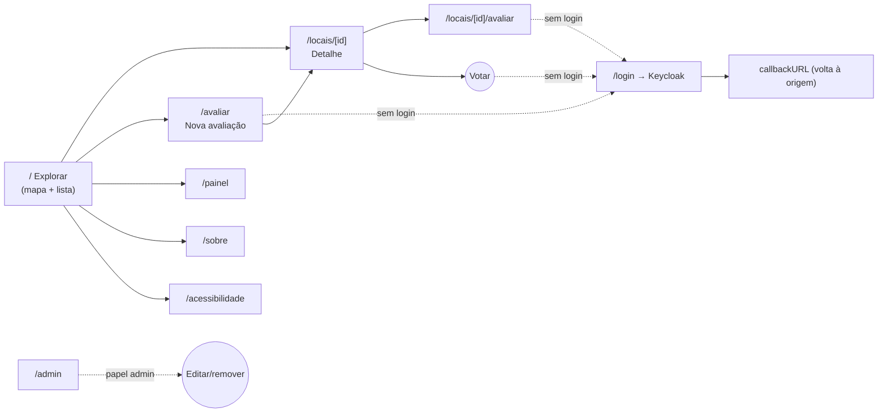
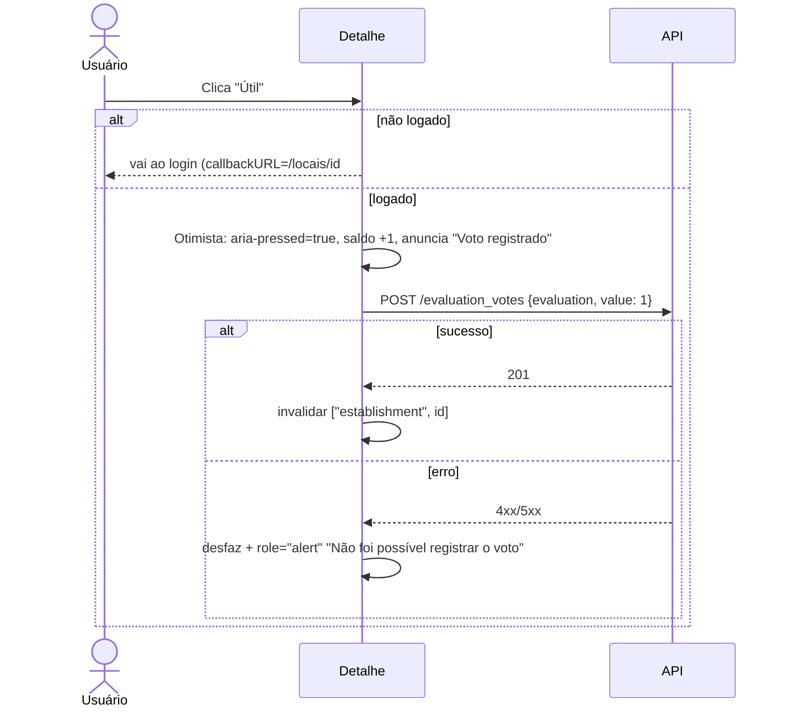
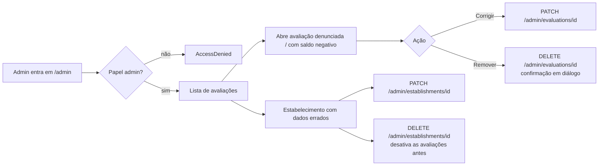

# 4. Fluxos

Os diagramas usam Mermaid, que o GitHub renderiza. Depois de cada diagrama há uma **descrição textual equivalente**, para quem não enxerga o diagrama.

## 4.1 Mapa de navegação



**Descrição:** da tela Explorar, a pessoa vai para o detalhe de um local, para a nova avaliação, para o painel, para Sobre ou para Acessibilidade. Do detalhe, pode avaliar aquele local ou votar nas avaliações. Avaliar e votar sem login levam ao Keycloak, que devolve a pessoa ao ponto de origem. Ao terminar uma avaliação, a pessoa vai para o detalhe do local. `/admin` é acessível apenas ao papel admin.

## 4.2 F1: Explorar e filtrar locais

```mermaid
sequenceDiagram
    actor U as Usuário
    participant UI as Tela Explorar
    participant RQ as React Query
    participant API as API
    U->>UI: Abre "/"
    UI->>RQ: useQuery(["establishments", filtros])
    RQ->>API: GET /establishments?page=1
    API-->>RQ: Collection (member, totalItems, view)
    RQ-->>UI: dados
    UI-->>U: pinos no mapa / cartões na lista + "N locais encontrados" (aria-live)
    U->>UI: Seleciona "Cadeira de rodas: Bom" e "Aplicar"
    UI->>UI: Atualiza a URL (?cr=bom)
    UI->>RQ: nova key
    RQ->>API: GET /establishments?criterion_average[wheelchair_accessible]=bom
    API-->>UI: resultados filtrados
    UI-->>U: anuncia "8 locais encontrados"; foco continua no botão Aplicar
```

**Descrição:**
1. A pessoa abre a página inicial e o app busca a primeira página de estabelecimentos.
2. Os locais aparecem no mapa (ou na lista, se essa for a preferência) e o total é anunciado.
3. A pessoa escolhe filtros e aplica. A URL é atualizada, o app busca de novo e anuncia o novo total **sem mover o foco**.
4. Se não houver resultados, aparecem as opções "Limpar filtros" e "Avaliar um local".

Variações:
- **Geolocalização:** só ao clicar em "Minha localização". Se a permissão for negada, mostrar "Não foi possível obter sua localização. O mapa continua centrado em Tubarão."
- **Leitor de tela:** a lista é oferecida como visualização principal (preferência salva).

## 4.3 F2: Consultar um local

1. A partir de um pino (Enter/clique abre o cartão-resumo → "Ver detalhes") ou de um cartão da lista (link no nome).
2. `GET /establishments/{id}` (a tela pode ser renderizada no servidor para carregar rápido e melhorar o SEO).
3. O foco vai para o `<h1>` com o nome do local.
4. A pessoa lê o resumo (tabela) e as avaliações. As que têm saldo `≤ -3` ficam recolhidas.
5. "Voltar para resultados" retorna à tela Explorar **com os mesmos filtros e a mesma posição** (filtros na URL + restauração de rolagem).

## 4.4 F3: Avaliar um local (fluxo principal de contribuição)

```mermaid
flowchart TD
    A[Clique em "Avaliar"] --> B{Logado?}
    B -- Não --> B1[Mostrar aviso + permitir preencher<br/>rascunho em sessionStorage]
    B -- Sim --> C
    B1 --> C[Passo 1: Escolher local<br/>Places Autocomplete → place_id]
    C --> D[Passo 2: Notas 0–10 por critério<br/>ou 'Não sei']
    D --> D1{Pelo menos 1 nota?}
    D1 -- Não --> D2[Erro: 'Avalie pelo menos um critério'] --> D
    D1 -- Sim --> E[Passo 3: Comentário e fotos]
    E --> F[Passo 4: Revisão]
    F --> G{Logado?}
    G -- Não --> G1[Salvar rascunho → /login?callbackURL=/avaliar?etapa=4] --> F
    G -- Sim --> H[POST /evaluations]
    H --> I{Resposta}
    I -- 201 --> J[Invalidar cache → /locais/id<br/>toast 'Obrigado!' + foco no h1]
    I -- 400 --> K[Volta ao passo 1<br/>'Local não identificado']
    I -- 422 comment --> L[Volta ao passo 3<br/>mensagem da moderação]
    I -- 422 rating --> M[Volta ao passo 2<br/>erro no critério]
    I -- 401 --> G1
    I -- 5xx/rede --> N[Manter dados + 'Tentar novamente']
```

**Descrição:**
1. Ao clicar em "Avaliar", a pessoa pode começar mesmo sem login; o rascunho fica salvo na sessão do navegador.
2. **Passo 1:** escolhe o local pelo campo de busca do Google Places, que devolve o `place_id`. Se veio do detalhe, este passo já está preenchido.
3. **Passo 2:** dá nota de 0 a 10 aos critérios que observou; os demais ficam como "Não sei". É preciso avaliar pelo menos um.
4. **Passo 3:** comentário opcional (e fotos, quando a lacuna L1 for resolvida).
5. **Passo 4:** revisa. Se não estiver logada, é levada ao login e volta ao passo 4 com os dados restaurados.
6. O app envia `POST /evaluations` com `establishmentGooglePlaceId`, `comment` e apenas os critérios avaliados.
7. Sucesso: vai ao detalhe do local, com agradecimento e o foco no título. Erros levam de volta ao passo correspondente, com a mensagem junto ao campo e um resumo no topo.

Montagem do corpo:

```ts
const body = {
  establishmentGooglePlaceId: draft.placeId,
  comment: draft.comment?.trim() || undefined,
  ratings: Object.entries(draft.ratings)
    .filter(([, v]) => v !== "nao-sei")
    .map(([criterion, v]) => ({ criterion, rating: Number(v) })),
};
```

## 4.5 F4: Votar em uma avaliação



**Descrição:** com login, o clique marca o botão na hora, ajusta o saldo, anuncia "Voto registrado" e envia o voto. Em caso de erro, desfaz e avisa. Clicar no voto oposto troca o voto. Clicar no voto já ativo não faz nada e anuncia "Você já marcou esta avaliação como útil" (não há remoção de voto na API).

## 4.6 F5: Autenticação

1. "Entrar" chama `signInWithKeycloak(window.location.href)`.
2. Keycloak (Authorization Code + PKCE). O `better-auth` troca o código pelo token no servidor (`/api/auth/[...all]`).
3. Retorno ao `callbackURL`. O cabeçalho mostra o nome e o anúncio "Você entrou como Marina".
4. "Sair" chama `signOutWithKeycloak(origin + "/")`, que encerra a sessão local e no Keycloak.
5. Token expirado (401 em uma mutação): tentar `authClient.getAccessToken` (refresh). Se falhar, salvar o estado e pedir login.

## 4.7 F6: Consultar o painel de dados

1. `/painel` busca todas as páginas de `/establishments` (ou `GET /stats` após a lacuna L4).
2. Calcula no cliente os KPIs, as médias por critério, a distribuição por situação e o ranking.
3. Filtro por endereço/bairro refaz a busca com `?address=`.
4. "Baixar CSV" gera o arquivo no cliente e anuncia "Download iniciado".

## 4.8 F7: Moderação (admin)



**Descrição:** o admin acessa `/admin`. Sem o papel, vê "Acesso negado". Com o papel, pode corrigir (PATCH) ou remover (DELETE, com confirmação) avaliações e estabelecimentos. Remover um estabelecimento desativa as avaliações dele antes.

## 4.9 F8: Preferências de acessibilidade

1. O botão "Aa / Acessibilidade" no cabeçalho abre um diálogo (`Dialog` com foco preso e Esc para fechar).
2. Opções: tamanho do texto (100%, 125%, 150%, 200%), alto contraste, reduzir animações, fonte para dislexia, espaçamento de texto ampliado, sublinhar todos os links, preferir lista ao mapa.
3. A mudança é aplicada na hora (classes/atributos em `<html>`) e salva em `localStorage`. O anúncio "Preferência aplicada" é feito na região *live*.
4. As preferências são lidas **antes da hidratação** (script inline no `<head>`), para evitar o "flash" do tema errado.
